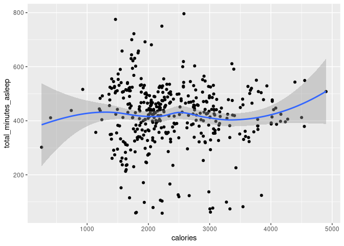
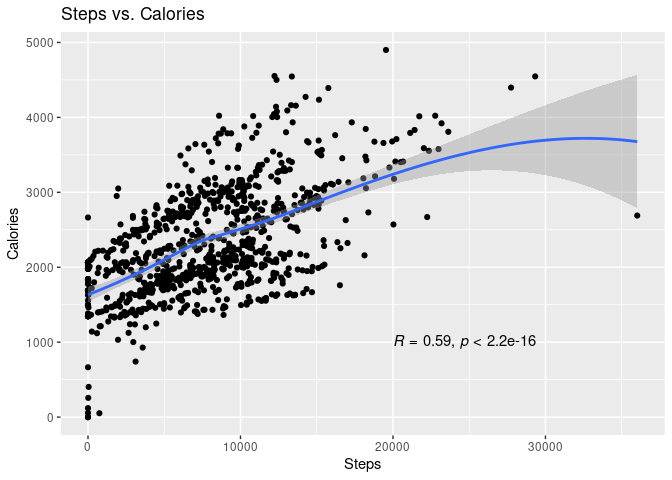
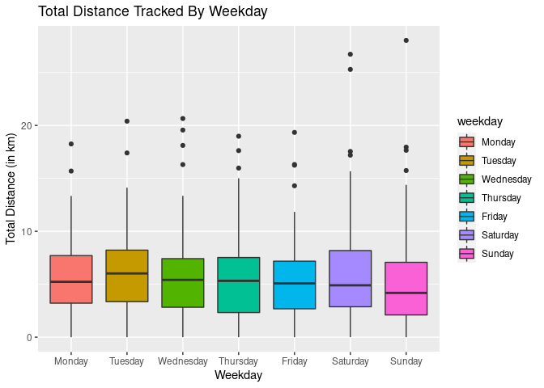
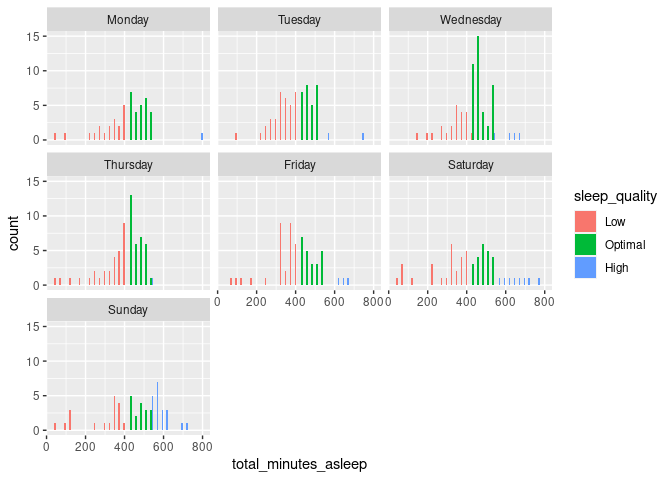
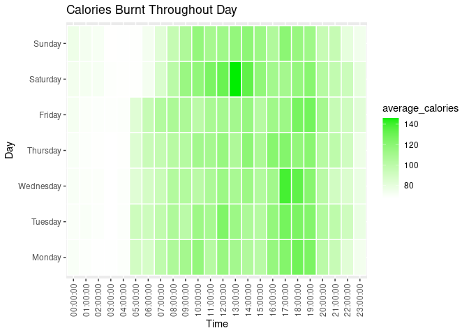

Bellabeat Case Study
================
Joseph Kim
2022-10-10

## Data validation

``` r
head(daily_activity)
```

    ##           Id ActivityDate TotalSteps TotalDistance TrackerDistance
    ## 1 1503960366    4/12/2016      13162          8.50            8.50
    ## 2 1503960366    4/13/2016      10735          6.97            6.97
    ## 3 1503960366    4/14/2016      10460          6.74            6.74
    ## 4 1503960366    4/15/2016       9762          6.28            6.28
    ## 5 1503960366    4/16/2016      12669          8.16            8.16
    ## 6 1503960366    4/17/2016       9705          6.48            6.48
    ##   LoggedActivitiesDistance VeryActiveDistance ModeratelyActiveDistance
    ## 1                        0               1.88                     0.55
    ## 2                        0               1.57                     0.69
    ## 3                        0               2.44                     0.40
    ## 4                        0               2.14                     1.26
    ## 5                        0               2.71                     0.41
    ## 6                        0               3.19                     0.78
    ##   LightActiveDistance SedentaryActiveDistance VeryActiveMinutes
    ## 1                6.06                       0                25
    ## 2                4.71                       0                21
    ## 3                3.91                       0                30
    ## 4                2.83                       0                29
    ## 5                5.04                       0                36
    ## 6                2.51                       0                38
    ##   FairlyActiveMinutes LightlyActiveMinutes SedentaryMinutes Calories
    ## 1                  13                  328              728     1985
    ## 2                  19                  217              776     1797
    ## 3                  11                  181             1218     1776
    ## 4                  34                  209              726     1745
    ## 5                  10                  221              773     1863
    ## 6                  20                  164              539     1728

``` r
head(heartrate_seconds)
```

    ##           Id                 Time Value
    ## 1 2022484408 4/12/2016 7:21:00 AM    97
    ## 2 2022484408 4/12/2016 7:21:05 AM   102
    ## 3 2022484408 4/12/2016 7:21:10 AM   105
    ## 4 2022484408 4/12/2016 7:21:20 AM   103
    ## 5 2022484408 4/12/2016 7:21:25 AM   101
    ## 6 2022484408 4/12/2016 7:22:05 AM    95

``` r
head(sleep_day)
```

    ##           Id              SleepDay TotalSleepRecords TotalMinutesAsleep
    ## 1 1503960366 4/12/2016 12:00:00 AM                 1                327
    ## 2 1503960366 4/13/2016 12:00:00 AM                 2                384
    ## 3 1503960366 4/15/2016 12:00:00 AM                 1                412
    ## 4 1503960366 4/16/2016 12:00:00 AM                 2                340
    ## 5 1503960366 4/17/2016 12:00:00 AM                 1                700
    ## 6 1503960366 4/19/2016 12:00:00 AM                 1                304
    ##   TotalTimeInBed
    ## 1            346
    ## 2            407
    ## 3            442
    ## 4            367
    ## 5            712
    ## 6            320

``` r
head(weight_log_info)
```

    ##           Id                  Date WeightKg WeightPounds Fat   BMI
    ## 1 1503960366  5/2/2016 11:59:59 PM     52.6     115.9631  22 22.65
    ## 2 1503960366  5/3/2016 11:59:59 PM     52.6     115.9631  NA 22.65
    ## 3 1927972279  4/13/2016 1:08:52 AM    133.5     294.3171  NA 47.54
    ## 4 2873212765 4/21/2016 11:59:59 PM     56.7     125.0021  NA 21.45
    ## 5 2873212765 5/12/2016 11:59:59 PM     57.3     126.3249  NA 21.69
    ## 6 4319703577 4/17/2016 11:59:59 PM     72.4     159.6147  25 27.45
    ##   IsManualReport        LogId
    ## 1           True 1.462234e+12
    ## 2           True 1.462320e+12
    ## 3          False 1.460510e+12
    ## 4           True 1.461283e+12
    ## 5           True 1.463098e+12
    ## 6           True 1.460938e+12

``` r
head(hourly_calories)
```

    ##           Id          ActivityHour Calories
    ## 1 1503960366 4/12/2016 12:00:00 AM       81
    ## 2 1503960366  4/12/2016 1:00:00 AM       61
    ## 3 1503960366  4/12/2016 2:00:00 AM       59
    ## 4 1503960366  4/12/2016 3:00:00 AM       47
    ## 5 1503960366  4/12/2016 4:00:00 AM       48
    ## 6 1503960366  4/12/2016 5:00:00 AM       48

``` r
head(daily_activity)
```

    ##           Id ActivityDate TotalSteps TotalDistance TrackerDistance
    ## 1 1503960366    4/12/2016      13162          8.50            8.50
    ## 2 1503960366    4/13/2016      10735          6.97            6.97
    ## 3 1503960366    4/14/2016      10460          6.74            6.74
    ## 4 1503960366    4/15/2016       9762          6.28            6.28
    ## 5 1503960366    4/16/2016      12669          8.16            8.16
    ## 6 1503960366    4/17/2016       9705          6.48            6.48
    ##   LoggedActivitiesDistance VeryActiveDistance ModeratelyActiveDistance
    ## 1                        0               1.88                     0.55
    ## 2                        0               1.57                     0.69
    ## 3                        0               2.44                     0.40
    ## 4                        0               2.14                     1.26
    ## 5                        0               2.71                     0.41
    ## 6                        0               3.19                     0.78
    ##   LightActiveDistance SedentaryActiveDistance VeryActiveMinutes
    ## 1                6.06                       0                25
    ## 2                4.71                       0                21
    ## 3                3.91                       0                30
    ## 4                2.83                       0                29
    ## 5                5.04                       0                36
    ## 6                2.51                       0                38
    ##   FairlyActiveMinutes LightlyActiveMinutes SedentaryMinutes Calories
    ## 1                  13                  328              728     1985
    ## 2                  19                  217              776     1797
    ## 3                  11                  181             1218     1776
    ## 4                  34                  209              726     1745
    ## 5                  10                  221              773     1863
    ## 6                  20                  164              539     1728

``` r
head(heartrate_seconds)
```

    ##           Id                 Time Value
    ## 1 2022484408 4/12/2016 7:21:00 AM    97
    ## 2 2022484408 4/12/2016 7:21:05 AM   102
    ## 3 2022484408 4/12/2016 7:21:10 AM   105
    ## 4 2022484408 4/12/2016 7:21:20 AM   103
    ## 5 2022484408 4/12/2016 7:21:25 AM   101
    ## 6 2022484408 4/12/2016 7:22:05 AM    95

``` r
head(sleep_day)
```

    ##           Id              SleepDay TotalSleepRecords TotalMinutesAsleep
    ## 1 1503960366 4/12/2016 12:00:00 AM                 1                327
    ## 2 1503960366 4/13/2016 12:00:00 AM                 2                384
    ## 3 1503960366 4/15/2016 12:00:00 AM                 1                412
    ## 4 1503960366 4/16/2016 12:00:00 AM                 2                340
    ## 5 1503960366 4/17/2016 12:00:00 AM                 1                700
    ## 6 1503960366 4/19/2016 12:00:00 AM                 1                304
    ##   TotalTimeInBed
    ## 1            346
    ## 2            407
    ## 3            442
    ## 4            367
    ## 5            712
    ## 6            320

``` r
head(weight_log_info)
```

    ##           Id                  Date WeightKg WeightPounds Fat   BMI
    ## 1 1503960366  5/2/2016 11:59:59 PM     52.6     115.9631  22 22.65
    ## 2 1503960366  5/3/2016 11:59:59 PM     52.6     115.9631  NA 22.65
    ## 3 1927972279  4/13/2016 1:08:52 AM    133.5     294.3171  NA 47.54
    ## 4 2873212765 4/21/2016 11:59:59 PM     56.7     125.0021  NA 21.45
    ## 5 2873212765 5/12/2016 11:59:59 PM     57.3     126.3249  NA 21.69
    ## 6 4319703577 4/17/2016 11:59:59 PM     72.4     159.6147  25 27.45
    ##   IsManualReport        LogId
    ## 1           True 1.462234e+12
    ## 2           True 1.462320e+12
    ## 3          False 1.460510e+12
    ## 4           True 1.461283e+12
    ## 5           True 1.463098e+12
    ## 6           True 1.460938e+12

``` r
head(hourly_calories)
```

    ##           Id          ActivityHour Calories
    ## 1 1503960366 4/12/2016 12:00:00 AM       81
    ## 2 1503960366  4/12/2016 1:00:00 AM       61
    ## 3 1503960366  4/12/2016 2:00:00 AM       59
    ## 4 1503960366  4/12/2016 3:00:00 AM       47
    ## 5 1503960366  4/12/2016 4:00:00 AM       48
    ## 6 1503960366  4/12/2016 5:00:00 AM       48

Things to note: *weightLogInfo_merged* dataset only had 8 out of 33
total users recorded, which is a low representation of the users
recorded in the *dailyActivity_merged* dataset (about 24% of
population). This may give a result that does not enough power and
potentially result in a Type II error.

I also noticed that some date columns were in character format, and
therefore converted to date format using the **lubridate** package.

``` r
daily_activity$ActivityDate <- mdy(daily_activity$ActivityDate, format = NULL)
heartrate_seconds$Time <- mdy_hms(heartrate_seconds$Time, format = NULL)
sleep_day$SleepDay <- mdy_hms(sleep_day$SleepDay, format = NULL)

str(daily_activity)
```

    ## 'data.frame':    940 obs. of  15 variables:
    ##  $ Id                      : num  1.5e+09 1.5e+09 1.5e+09 1.5e+09 1.5e+09 ...
    ##  $ ActivityDate            : Date, format: "2016-04-12" "2016-04-13" ...
    ##  $ TotalSteps              : int  13162 10735 10460 9762 12669 9705 13019 15506 10544 9819 ...
    ##  $ TotalDistance           : num  8.5 6.97 6.74 6.28 8.16 ...
    ##  $ TrackerDistance         : num  8.5 6.97 6.74 6.28 8.16 ...
    ##  $ LoggedActivitiesDistance: num  0 0 0 0 0 0 0 0 0 0 ...
    ##  $ VeryActiveDistance      : num  1.88 1.57 2.44 2.14 2.71 ...
    ##  $ ModeratelyActiveDistance: num  0.55 0.69 0.4 1.26 0.41 ...
    ##  $ LightActiveDistance     : num  6.06 4.71 3.91 2.83 5.04 ...
    ##  $ SedentaryActiveDistance : num  0 0 0 0 0 0 0 0 0 0 ...
    ##  $ VeryActiveMinutes       : int  25 21 30 29 36 38 42 50 28 19 ...
    ##  $ FairlyActiveMinutes     : int  13 19 11 34 10 20 16 31 12 8 ...
    ##  $ LightlyActiveMinutes    : int  328 217 181 209 221 164 233 264 205 211 ...
    ##  $ SedentaryMinutes        : int  728 776 1218 726 773 539 1149 775 818 838 ...
    ##  $ Calories                : int  1985 1797 1776 1745 1863 1728 1921 2035 1786 1775 ...

``` r
str(heartrate_seconds)
```

    ## 'data.frame':    2483658 obs. of  3 variables:
    ##  $ Id   : num  2.02e+09 2.02e+09 2.02e+09 2.02e+09 2.02e+09 ...
    ##  $ Time : POSIXct, format: "2016-04-12 07:21:00" "2016-04-12 07:21:05" ...
    ##  $ Value: int  97 102 105 103 101 95 91 93 94 93 ...

``` r
str(sleep_day)
```

    ## 'data.frame':    413 obs. of  5 variables:
    ##  $ Id                : num  1.5e+09 1.5e+09 1.5e+09 1.5e+09 1.5e+09 ...
    ##  $ SleepDay          : POSIXct, format: "2016-04-12" "2016-04-13" ...
    ##  $ TotalSleepRecords : int  1 2 1 2 1 1 1 1 1 1 ...
    ##  $ TotalMinutesAsleep: int  327 384 412 340 700 304 360 325 361 430 ...
    ##  $ TotalTimeInBed    : int  346 407 442 367 712 320 377 364 384 449 ...

## Data preparation

``` r
# Renaming columns
daily_activity <- daily_activity %>%
    clean_names() %>%
    rename_with(tolower) %>%
    rename(date = activity_date)

heartrate_seconds <- heartrate_seconds %>%
    clean_names() %>%
    rename_with(tolower)

sleep_day <- sleep_day %>%
    clean_names() %>%
    rename_with(tolower) %>%
    rename(date = sleep_day)

hourly_calories <- hourly_calories %>%
    clean_names() %>%
    rename_with(tolower) %>%
    rename(date_time = activity_hour)

# Getting statistical summaries of each table
summary(daily_activity)
```

    ##        id                 date             total_steps    total_distance  
    ##  Min.   :1.504e+09   Min.   :2016-04-12   Min.   :    0   Min.   : 0.000  
    ##  1st Qu.:2.320e+09   1st Qu.:2016-04-19   1st Qu.: 3790   1st Qu.: 2.620  
    ##  Median :4.445e+09   Median :2016-04-26   Median : 7406   Median : 5.245  
    ##  Mean   :4.855e+09   Mean   :2016-04-26   Mean   : 7638   Mean   : 5.490  
    ##  3rd Qu.:6.962e+09   3rd Qu.:2016-05-04   3rd Qu.:10727   3rd Qu.: 7.713  
    ##  Max.   :8.878e+09   Max.   :2016-05-12   Max.   :36019   Max.   :28.030  
    ##  tracker_distance logged_activities_distance very_active_distance
    ##  Min.   : 0.000   Min.   :0.0000             Min.   : 0.000      
    ##  1st Qu.: 2.620   1st Qu.:0.0000             1st Qu.: 0.000      
    ##  Median : 5.245   Median :0.0000             Median : 0.210      
    ##  Mean   : 5.475   Mean   :0.1082             Mean   : 1.503      
    ##  3rd Qu.: 7.710   3rd Qu.:0.0000             3rd Qu.: 2.053      
    ##  Max.   :28.030   Max.   :4.9421             Max.   :21.920      
    ##  moderately_active_distance light_active_distance sedentary_active_distance
    ##  Min.   :0.0000             Min.   : 0.000        Min.   :0.000000         
    ##  1st Qu.:0.0000             1st Qu.: 1.945        1st Qu.:0.000000         
    ##  Median :0.2400             Median : 3.365        Median :0.000000         
    ##  Mean   :0.5675             Mean   : 3.341        Mean   :0.001606         
    ##  3rd Qu.:0.8000             3rd Qu.: 4.782        3rd Qu.:0.000000         
    ##  Max.   :6.4800             Max.   :10.710        Max.   :0.110000         
    ##  very_active_minutes fairly_active_minutes lightly_active_minutes
    ##  Min.   :  0.00      Min.   :  0.00        Min.   :  0.0         
    ##  1st Qu.:  0.00      1st Qu.:  0.00        1st Qu.:127.0         
    ##  Median :  4.00      Median :  6.00        Median :199.0         
    ##  Mean   : 21.16      Mean   : 13.56        Mean   :192.8         
    ##  3rd Qu.: 32.00      3rd Qu.: 19.00        3rd Qu.:264.0         
    ##  Max.   :210.00      Max.   :143.00        Max.   :518.0         
    ##  sedentary_minutes    calories   
    ##  Min.   :   0.0    Min.   :   0  
    ##  1st Qu.: 729.8    1st Qu.:1828  
    ##  Median :1057.5    Median :2134  
    ##  Mean   : 991.2    Mean   :2304  
    ##  3rd Qu.:1229.5    3rd Qu.:2793  
    ##  Max.   :1440.0    Max.   :4900

``` r
summary(heartrate_seconds)
```

    ##        id                 time                            value       
    ##  Min.   :2.022e+09   Min.   :2016-04-12 00:00:00.00   Min.   : 36.00  
    ##  1st Qu.:4.388e+09   1st Qu.:2016-04-19 06:18:10.00   1st Qu.: 63.00  
    ##  Median :5.554e+09   Median :2016-04-26 20:28:50.00   Median : 73.00  
    ##  Mean   :5.514e+09   Mean   :2016-04-26 19:43:52.24   Mean   : 77.33  
    ##  3rd Qu.:6.962e+09   3rd Qu.:2016-05-04 08:00:20.00   3rd Qu.: 88.00  
    ##  Max.   :8.878e+09   Max.   :2016-05-12 16:20:00.00   Max.   :203.00

``` r
summary(sleep_day)
```

    ##        id                 date                        total_sleep_records
    ##  Min.   :1.504e+09   Min.   :2016-04-12 00:00:00.00   Min.   :1.000      
    ##  1st Qu.:3.977e+09   1st Qu.:2016-04-19 00:00:00.00   1st Qu.:1.000      
    ##  Median :4.703e+09   Median :2016-04-27 00:00:00.00   Median :1.000      
    ##  Mean   :5.001e+09   Mean   :2016-04-26 12:40:05.80   Mean   :1.119      
    ##  3rd Qu.:6.962e+09   3rd Qu.:2016-05-04 00:00:00.00   3rd Qu.:1.000      
    ##  Max.   :8.792e+09   Max.   :2016-05-12 00:00:00.00   Max.   :3.000      
    ##  total_minutes_asleep total_time_in_bed
    ##  Min.   : 58.0        Min.   : 61.0    
    ##  1st Qu.:361.0        1st Qu.:403.0    
    ##  Median :433.0        Median :463.0    
    ##  Mean   :419.5        Mean   :458.6    
    ##  3rd Qu.:490.0        3rd Qu.:526.0    
    ##  Max.   :796.0        Max.   :961.0

``` r
summary(hourly_calories)
```

    ##        id             date_time            calories     
    ##  Min.   :1.504e+09   Length:22099       Min.   : 42.00  
    ##  1st Qu.:2.320e+09   Class :character   1st Qu.: 63.00  
    ##  Median :4.445e+09   Mode  :character   Median : 83.00  
    ##  Mean   :4.848e+09                      Mean   : 97.39  
    ##  3rd Qu.:6.962e+09                      3rd Qu.:108.00  
    ##  Max.   :8.878e+09                      Max.   :948.00

``` r
# Removing duplicates and N/A
daily_activity <- daily_activity %>%
    distinct() %>%
    drop_na()

heartrate_seconds <- heartrate_seconds %>%
    distinct() %>%
    drop_na()

sleep_day <- sleep_day %>%
    distinct() %>%
    drop_na()
```

## Merging data

``` r
merged_activity_sleep <- merge(daily_activity, sleep_day, by = c('id', 'date'))
head(merged_activity_sleep)
```

    ##           id       date total_steps total_distance tracker_distance
    ## 1 1503960366 2016-04-12       13162           8.50             8.50
    ## 2 1503960366 2016-04-13       10735           6.97             6.97
    ## 3 1503960366 2016-04-15        9762           6.28             6.28
    ## 4 1503960366 2016-04-16       12669           8.16             8.16
    ## 5 1503960366 2016-04-17        9705           6.48             6.48
    ## 6 1503960366 2016-04-19       15506           9.88             9.88
    ##   logged_activities_distance very_active_distance moderately_active_distance
    ## 1                          0                 1.88                       0.55
    ## 2                          0                 1.57                       0.69
    ## 3                          0                 2.14                       1.26
    ## 4                          0                 2.71                       0.41
    ## 5                          0                 3.19                       0.78
    ## 6                          0                 3.53                       1.32
    ##   light_active_distance sedentary_active_distance very_active_minutes
    ## 1                  6.06                         0                  25
    ## 2                  4.71                         0                  21
    ## 3                  2.83                         0                  29
    ## 4                  5.04                         0                  36
    ## 5                  2.51                         0                  38
    ## 6                  5.03                         0                  50
    ##   fairly_active_minutes lightly_active_minutes sedentary_minutes calories
    ## 1                    13                    328               728     1985
    ## 2                    19                    217               776     1797
    ## 3                    34                    209               726     1745
    ## 4                    10                    221               773     1863
    ## 5                    20                    164               539     1728
    ## 6                    31                    264               775     2035
    ##   total_sleep_records total_minutes_asleep total_time_in_bed
    ## 1                   1                  327               346
    ## 2                   2                  384               407
    ## 3                   1                  412               442
    ## 4                   2                  340               367
    ## 5                   1                  700               712
    ## 6                   1                  304               320

## Visualizations

``` r
ggplot(data = merged_activity_sleep, mapping = aes(x = calories, y = total_minutes_asleep)) +
    geom_point() +
    geom_smooth()
```

    ## `geom_smooth()` using method = 'loess' and formula 'y ~ x'

<!-- -->

We can see from above that there is not much correlation between
calories burnt and sleep quality. We will need to explore other
relationships that can suggest new business ideas.

``` r
# Relationship between steps and calories
daily_activity %>%
    ggplot(aes(total_steps, calories)) +
    geom_point() +
    geom_smooth() +
    stat_cor(method = "pearson", label.x = 20000, label.y = 1000) +
    labs(title = 'Steps vs. Calories', x = 'Steps', y = 'Calories')
```

    ## `geom_smooth()` using method = 'loess' and formula 'y ~ x'

<!-- -->

We can see from above that although there is a positive correlation
between steps and calories, the correlation coefficient of 0.59 is lower
than expected.

``` r
daily_activity %>%
    mutate(weekday = weekdays(date)) %>%
    select(id, total_distance, weekday) %>%
    mutate(weekday = factor(weekday, levels = c('Monday', 'Tuesday', 'Wednesday', 'Thursday', 'Friday', 'Saturday', 'Sunday'))) %>% 
    ggplot(aes(x = weekday, y = total_distance, fill = weekday)) + 
    geom_boxplot() +
    labs(title = 'Total Distance Tracked By Weekday', x = 'Weekday', y = 'Total Distance (in km)')
```

<!-- -->

We can see that total distance tracked stayed consistent during the
weekdays, with similar medians and maximum/minimum values. This could be
because most people work on weekdays, resulting in consistent results in
activity. Meanwhile, we can see that distance tracked was highest on
Saturday and lowest on Sunday - this could be telling that people are
more active and are out more on Saturdays, while they tend to stay at
home on Sunday.

``` r
merged_activity_sleep %>%
    mutate(weekday = weekdays(date)) %>%
    select(id, date, total_minutes_asleep, weekday) %>%
    mutate(sleep_quality = ifelse(total_minutes_asleep <= 420, 'Low', ifelse(total_minutes_asleep <= 540, 'Optimal', 'High'))) %>%
    mutate(sleep_quality = factor(sleep_quality, levels = c('Low', 'Optimal', 'High'))) %>% 
    mutate(weekday = factor(weekday, levels = c('Monday', 'Tuesday', 'Wednesday', 'Thursday', 'Friday', 'Saturday', 'Sunday'))) %>% 
    
    ggplot(aes(x = total_minutes_asleep, fill = sleep_quality)) + 
    geom_histogram(position = 'dodge', bins = 30) +
    facet_wrap(~weekday)
```

<!-- -->

``` r
    labs(title = 'Distribution of Sleep Quality by Weekday', x = 'Total Minutes Asleep', y = 'Count')
```

    ## $x
    ## [1] "Total Minutes Asleep"
    ## 
    ## $y
    ## [1] "Count"
    ## 
    ## $title
    ## [1] "Distribution of Sleep Quality by Weekday"
    ## 
    ## attr(,"class")
    ## [1] "labels"

We can see from above that the amount of sleep for the users follows a
normal distribution, with a mean of around 7 hours of sleep. Going
deeper into each day, we can see that the distribution of sleep time is
relatively higher on Wednesday and Thursday, and lower on Saturday and
Sunday. This is interesting as the weekend is generally thought to be
the time to sleep in for longer amounts of time.

Another possible reason for this distribution is users not wearing their
devices as often on weekends compared to weekdays.

``` r
hourly_calories %>%
    mutate(date_time = as.POSIXct(date_time, format="%m/%d/%Y %I:%M:%S %p", tz = Sys.timezone())) %>%
    separate(date_time, into = c('date', 'time'), sep = ' ') %>%
    mutate(date = ymd(date)) %>%
    mutate(weekday = weekdays(date)) %>%
    group_by(weekday, time) %>%
    summarize(average_calories = mean(calories), .groups = 'drop') %>%
    mutate(weekday = factor(weekday, levels = c('Monday', 'Tuesday', 'Wednesday', 'Thursday', 'Friday', 'Saturday', 'Sunday'))) %>%

    ggplot(aes(time, weekday, fill = average_calories)) +
    scale_fill_gradient(low = 'white', high = 'green2') +
    geom_tile(color = 'white', lwd = 0.5, linetype = 1) +
    theme(axis.text.x = element_text(angle = 90, vjust = 0.5, hjust=1)) +
    labs(title = 'Calories Burnt Throughout Day', x = 'Time', y = 'Day', fill = 'average_calories')
```

<!-- -->

We can tell from above that users are most actively burning calories in
the afternoon, with almost no calories burnt between 12am - 4am. This is
expected as most people are sedentary at this time.

Another observation we can make is that users start their daily activity
later in the weekends as opposed to weekdays.

## Summary

After completing analysis using the FitBit Fitness Tracker data, we have
come to some conclusions that Bellabeat could use to further promote
growth in it’s success.

#### Target users

The target audience for the device would be users working in a
professional environment, with 9-5 jobs to be more exact. The
visualizations above show that users that used the FitBit tracker device
had consistent lifestyles throughout the week, with slightly higher
activity during the weekend. This suggests that the users were working
in a traditional working environment and spending their personal time
over the weekends.

We also see that users have little to no activity from 12am to 4am,
while activity is at its highest in the afternoon from 12pm to 6pm.
Bellabeat can explore adding notifications based on time, reminding the
user to exercise during peak hours in the afternoon, and to get ready
for bed around midnight.

#### Sleep quality

We can see from the distributions of sleep quality throughout the week
that users had more irregular sleeping patterns during the weekend as
opposed to the weekend. We also saw a decrease in optimal sleep quality
(7-9 hours) during the weekend as well. This suggests that users depart
from their weekday routines during the weekend, leading to these
irregularities. Bellabeat can look into adding a feature to customize
notifications and set custom routines for weekdays and weekend
separately, emphasizing the impact it would have to the users’ quality
of sleep.

#### Tracking calories

Finally, we see a positive correlation between total steps taken and
calories burnt. While this is a generall known fact, it is supported by
the correlation being positive. This can help set a daily walking goal
and inform users the impact it has in total calories burnt.
